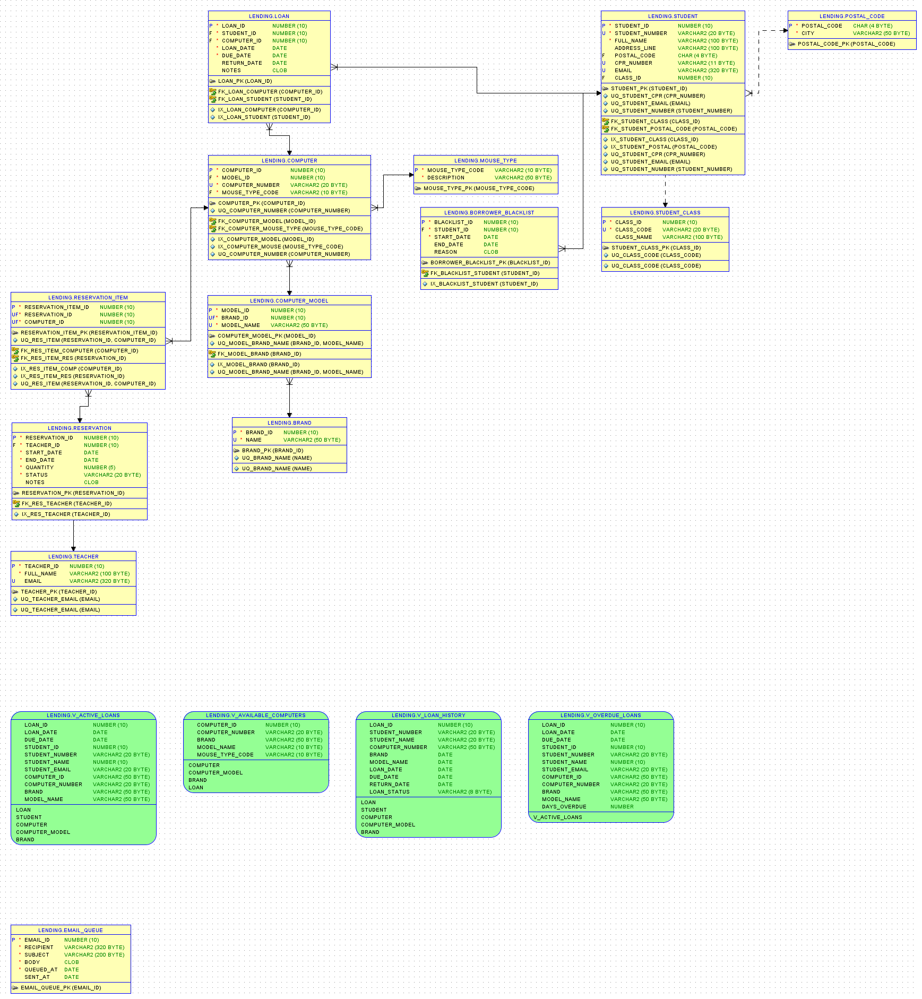

# Lending database system

This is an Oracle-based relational database design for a lending system. It is designed and normalized for Oracle (VARCHAR2, NUMBER, DATE, CLOB) and includes scripts to create the schema, views, sample data, and a small email queue simulator. 
---

- `setup_user.sql`  
  Creates the project schema (Oracle user) `LENDING` and grants the required privileges. Run once as SYS with role SYSDBA in the PDB (XEPDB1).

- `schema_oracle.sql`  
  Creates tables, indexes, constraints, triggers and seed lookup data. This is the core of the database model (BRAND, COMPUTER_MODEL, MOUSE_TYPE, COMPUTER, STUDENT, LOAN, etc.). Run as LENDING.

- `views_and_queries.sql`  
  Creates views:
  - `V_ACTIVE_LOANS` — who currently has laptops and due dates
  - `V_OVERDUE_LOANS` — active loans whose due date is before today
  - `V_AVAILABLE_COMPUTERS` — computers not currently on an active loan
  - `V_LOAN_HISTORY` — full loan history (active + returned)
  Run as LENDING after schema script.

- `test.sql`  
  Inserts safe example data (computer `PC-0722`, student `S-1001`) and creates a loan only when appropriate. You can run this repeatedly — it avoids duplicates.

- `send_overdue_emails.sql`  
  Simulates email reminders by inserting messages into `EMAIL_QUEUE` from `V_OVERDUE_LOANS`.

- `erd.png`  
<p align="center">
  
</p>


---

Prerequisites (on your PC)
- Oracle Database XE / Free installed and running, PDB available (service name: XEPDB1 or FREEPDB1)
- SQL Developer (or SQL*Plus)
- Oracle SQL Developer (with Data Modeler)

Notes:
- Use `localhost` (or server name) and port `1521` unless your environment differs.
- Use the SYS user (Role = SYSDBA) only for admin tasks (create LENDING user). All application scripts run as `LENDING`.

---

Exact step-by-step instructions

1) Start Oracle and ensure listener is running
- Check listener:
```text
# Windows (Command Prompt as Administrator)
lsnrctl status
```
- If no listener, start it:
```text
lsnrctl start
```
- If listener fails to start, open Services (`services.msc`) and start Oracle TNS Listener service, then re-run `lsnrctl status`.

2) Connect as SYS (SYSDBA) to the PDB and create LENDING (one-time)
- In SQL Developer: create or open SYS connection with Role = SYSDBA, Service = XEPDB1.
- Verify container:
```sql
SELECT sys_context('USERENV','CON_NAME') FROM dual;
-- If result = CDB$ROOT, switch:
ALTER SESSION SET CONTAINER = XEPDB1;
```
- Create user (edit password):
```sql
CREATE USER LENDING IDENTIFIED BY "password"
  DEFAULT TABLESPACE USERS
  QUOTA UNLIMITED ON USERS;

GRANT CREATE SESSION, CREATE TABLE, CREATE SEQUENCE, CREATE VIEW, CREATE TRIGGER TO LENDING;
```
- Verify:
```sql
SELECT username, account_status FROM dba_users WHERE username = 'LENDING';
```

3) Create a LENDING connection in SQL Developer
- Connection name: `LENDING_XEPDB1`
- Username: `LENDING`
- Password: the password you chose
- Hostname: `localhost`
- Port: `1521`
- Service name: `XEPDB1`
- Test → Save → Connect
- Verify:
```sql
SELECT user, sys_context('USERENV','CON_NAME') FROM dual;
-- Expect: user = LENDING and CON_NAME = XEPDB1
```

4) Run the schema (create tables, triggers, seed data)
- Open `schema_oracle.sql` with the LENDING connection selected.
- Run Script (F5).
- What happens:
  - Lookup tables (BRAND, COMPUTER_MODEL, MOUSE_TYPE, POSTAL_CODE, STUDENT_CLASS) are created.
  - Core tables (COMPUTER, STUDENT, LOAN) created with PKs and FKs.
  - Function-based unique index created to allow only one active loan per computer.
  - Triggers created:
    - `TRG_LOAN_ENFORCE_BLACKLIST`: prevents loans if student is currently blacklisted (safe: does not query LOAN).
    - `TRG_LOAN_DEFAULT_DUE_DATE`: sets DUE_DATE = LOAN_DATE + 14 if omitted.
  - Seed data inserted into lookup tables.
- Expected output: many "Table created", "Trigger created", "Commit complete" messages.

5) Create the views
- Open `views_and_queries.sql` as LENDING and run (F5).
- Expected: "View created" messages for `V_ACTIVE_LOANS`, `V_OVERDUE_LOANS`, `V_AVAILABLE_COMPUTERS`, `V_LOAN_HISTORY`.

6) Smoke test — insert sample data & create a loan (safe)
- Open `smoke_test.sql` with LENDING connection and run (F5). This script will:
  - Insert `PC-0722` 
  - Insert `S-1001` 
  - Insert a LOAN for the student/computer only if computer is available
- Then run these selects to show results:
```sql
SELECT * FROM V_ACTIVE_LOANS;
SELECT * FROM V_AVAILABLE_COMPUTERS;
SELECT * FROM V_LOAN_HISTORY;
```

7) Simulate an overdue loan (safe)
- You must keep `DUE_DATE >= LOAN_DATE` otherwise constraint fails.
- To make a loan overdue:
```sql
UPDATE LOAN
SET LOAN_DATE = TRUNC(SYSDATE) - 10,
    DUE_DATE  = TRUNC(SYSDATE) - 1
WHERE LOAN_ID = (SELECT MAX(LOAN_ID) FROM LOAN);
COMMIT;
```
- Verify:
```sql
SELECT * FROM V_OVERDUE_LOANS;
```

8) Simulate sending reminder emails
- Run `send_overdue_emails.sql` (F5). It inserts rows into `EMAIL_QUEUE` using `V_OVERDUE_LOANS`.
- Check:
```sql
SELECT * FROM EMAIL_QUEUE ORDER BY QUEUED_AT DESC;
```

9) Return a laptop (mark as returned)
- To mark the last loan as returned:
```sql
UPDATE LOAN
SET RETURN_DATE = TRUNC(SYSDATE)
WHERE LOAN_ID = (SELECT MAX(LOAN_ID) FROM LOAN);
COMMIT;
```
- Verify:
```sql
SELECT * FROM V_ACTIVE_LOANS;           -- should no longer show that loan
SELECT * FROM V_AVAILABLE_COMPUTERS;    -- computer should reappear
SELECT * FROM V_LOAN_HISTORY;           -- status should switch to RETURNED
```

## ERD — How I created the diagram from the Oracle database

This project includes an ERD (erd.png) that was reverse‑engineered from the live Oracle schema. Below are the exact tools, steps, and verification commands I used so a grader or reviewer can reproduce the diagram and validate that it matches the implemented database.

Important
- The ERD image is exported from Oracle SQL Developer Data Modeler.
- The diagram shows table names, PKs/FKs and Oracle datatypes (VARCHAR2, NUMBER, DATE, CLOB).

Step‑by‑step: create ERD from the live Oracle schema (exact actions)

1) Connect to the PDB with a Data Modeler‑capable connection
- Open SQL Developer
- Create/test a connection to the PDB as the schema owner (user `LENDING`)
  - Host: localhost
  - Port: 1521
  - Service name: XEPDB1
  - Username: LENDING (or a user that has SELECT on the LENDING schema)

2) Open Data Modeler and import the data dictionary
- Menu: Tools → Data Modeler → Import → Data Dictionary
- Choose your LENDING connection and click Next
- Select the LENDING schema and choose the tables/objects to import (or Select All)
- Complete the import wizard (Next → Finish)

3) Confirm import succeeded
- The Import Log should show something like:
  - All Statements: 56
  - Imported Statements: 56
  - Failed Statements: 0

4) Open or create the Relational Diagram
- In Data Modeler browser: Relational Models → <your model> → double‑click the Relational Diagram
- If no diagram exists: right‑click the Relational Model → New Relational Diagram → choose the imported tables

5) Tidy layout and show Oracle datatypes
- Right‑click diagram background → Layout → Auto Layout
- Diagram → Properties → Enable "Show Column Types" (so columns display VARCHAR2/NUMBER/DATE/CLOB)
- Manually drag related clusters closer (e.g., BRAND → COMPUTER_MODEL → COMPUTER; STUDENT → LOAN)

Verification SQL (run as LENDING) — include outputs in REPORT.md for proof
- List tables and views:
```sql
SELECT table_name FROM user_tables ORDER BY table_name;
SELECT view_name FROM user_views WHERE view_name LIKE 'V_%' ORDER BY view_name;
```

- Show STUDENT table columns (confirms CPR exists in DB even if hidden on diagram):
```sql
SELECT column_name, data_type, nullable
FROM user_tab_columns
WHERE table_name = 'STUDENT'
ORDER BY column_id;
```

- Show referential constraints (FKs):
```sql
SELECT a.table_name child_table, a.column_name child_col,
       b.table_name parent_table, b.column_name parent_col
FROM (
  SELECT acc.table_name, acc.column_name, acc.constraint_name, acc.position
  FROM user_cons_columns acc
) a
JOIN user_constraints c ON a.constraint_name = c.constraint_name
JOIN user_cons_columns b ON c.r_constraint_name = b.constraint_name AND a.position = b.position
WHERE c.constraint_type = 'R'
ORDER BY a.table_name;
```

- Confirm LOAN.FK columns are NOT NULL (if you modelled them mandatory):
```sql
SELECT column_name, nullable
FROM user_tab_columns
WHERE table_name = 'LOAN' AND column_name IN ('STUDENT_ID','COMPUTER_ID');
```


```
- 


Short video demo script (what to record & say)
- Intro (10s): "This demo shows the Laptop Lending DB. I'll create the schema, populate sample data and show required functionality."
- Show GitHub repo and files (10s).
- Connect as SYS (Role=SYSDBA) to XEPDB1 — run `ALTER SESSION SET CONTAINER = XEPDB1;` and show result (5s).
- Run `setup_user.sql` as SYS (show output) — explain you created user `LENDING` (10s).
- Switch to `LENDING` connection and run `schema_oracle.sql` (F5) — scroll through created tables and explain each briefly: COMPUTER, STUDENT, LOAN, lookups (30s).
- Run `views_and_queries.sql` — explain each view: active, overdue, available, history (20s).
- Run `smoke_test.sql` — then run `SELECT * FROM V_ACTIVE_LOANS;` — explain the loan data (20s).
- Simulate overdue, run `V_OVERDUE_LOANS`, run `send_overdue_emails.sql` and show `SELECT * FROM EMAIL_QUEUE;` (20s).
- Return the laptop, show `V_AVAILABLE_COMPUTERS` again (10s).
- Open `erd.mmd` in mermaid.live and export `erd.png` (15s).
- End: show README and REPORT included in repo (10s).

---


